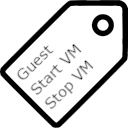
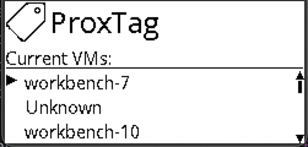

<!-- Improved compatibility of back to top link: See: https://github.com/othneildrew/Best-README-Template/pull/73 -->
<a id="readme-top"></a>
<!--
*** Thanks for checking out the Best-README-Template. If you have a suggestion
*** that would make this better, please fork the repo and create a pull request
*** or simply open an issue with the tag "enhancement".
*** Don't forget to give the project a star!
*** Thanks again! Now go create something AMAZING! :D
-->


<!-- PROJECT SHIELDS -->
<!--
*** I'm using markdown "reference style" links for readability.
*** Reference links are enclosed in brackets [ ] instead of parentheses ( ).
*** See the bottom of this document for the declaration of the reference variables
*** for contributors-url, forks-url, etc. This is an optional, concise syntax you may use.
*** https://www.markdownguide.org/basic-syntax/#reference-style-links
-->
[![Contributors][contributors-shield]][contributors-url]
[![Forks][forks-shield]][forks-url]
[![Stargazers][stars-shield]][stars-url]
[![Issues][issues-shield]][issues-url]
[![GPL License][license-shield]][license-url]
[![Buy me a coffee][coffee-shield]][coffee-url]


<!-- PROJECT LOGO -->
<br />
<div align="center">
  <a href="https://github.com/josephdc96/PMManager">
    
  </a>

<h3 align="center">ProxTag</h3>

  <p align="center">
    A Proxmox Manager designed for price tag-sized e-Ink displays
    <br />
    <!--<a href="https://github.com/josephdc96/PMManager"><strong>Explore the docs »</strong></a>
    <br />-->
    <a href="https://github.com/josephdc96/PMManager/issues/new?labels=bug&template=bug-report---.md">Report Bug</a>
    ·
    <a href="https://github.com/josephdc96/PMManager/issues/new?labels=enhancement&template=feature-request---.md">Request Feature</a>
  </p>
</div>


<!-- TABLE OF CONTENTS -->
<details>
  <summary>Table of Contents</summary>
  <ol>
    <li>
      <a href="#about-the-project">About The Project</a>
      <ul>
        <li><a href="#built-with">Built With</a></li>
      </ul>
    </li>
    <li>
      <a href="#getting-started">Getting Started</a>
      <ul>
        <li><a href="#prerequisites">Prerequisites</a></li>
        <li><a href="#installation">Installation (Local)</a></li>
        <li><a href="#installation">Installation (Docker)</a></li>
      </ul>
    </li>
    <li><a href="#usage">Usage</a></li>
    <li><a href="#contributing">Contributing</a></li>
    <li><a href="#license">License</a></li>
    <li><a href="#contact">Contact</a></li>
  </ol>
</details>


<!-- ABOUT THE PROJECT -->
## About The Project

<a href="https://github.com/josephdc96/PMManager">
    
  </a>

ProxTag is a Python project designed to offer VM power state management on a Raspberry Pi using an e-Ink display and a rotary encoder. 

<p align="right">(<a href="#readme-top">back to top</a>)</p>


### Built With 
[![Python][Python]][Python-url]

<p align="right">(<a href="#readme-top">back to top</a>)</p>


<!-- GETTING STARTED -->
## Getting Started

This is an example of how you may give instructions on setting up your project locally.
To get a local copy up and running follow these simple example steps.

### Prerequisites
To run ProxTag you need a local install of Python or Docker, as well as a local Proxmox server with a service account.

### Installation (Local)

1. Clone the repo
   ```sh
   git clone https://github.com/josephdc96/ProxTag.git
   ```
2. Set up virtual environment
   #### Linux
   ```shell
   python -m venv venv
   source ./venv/bin/activate
   ```
   #### Windows (PowerShell)
   ```
   python -m venv venv
   .\venv\bin\activate.ps1
   ```
   #### Windows (Command Prompt)
   ```shell
   python -m venv venv
   .\venv\bin\activate.bat
   ```
3. Install Python packages
   ```sh
   pip intall -r requirements.txt
   ```
4. Fill out your .env file using the .env.example file

<p align="right">(<a href="#readme-top">back to top</a>)</p>

### Installation (Docker)
1. Clone the repo
   ```sh
   git clone https://github.com/josephdc96/ProxTag.git
   ```
2. Build the docker image
   ```shell
   docker build -t proxtag:latest .
   ```

<!-- USAGE EXAMPLES -->
## Usage

### Running (Local)
```shell
python main.py
```

### Running (Docker)

To run list your environment variables in the Docker command
```shell
docker run -e HOST=<host> -e PORT=<port> -e SSL=<ssl> -e TOKEN='<token>' -e DRIVER=<driver> -e MODEL=<model> proxtag
```

<p align="right">(<a href="#readme-top">back to top</a>)</p>


<!-- CONTRIBUTING -->
## Contributing

Contributions are what make the open source community such an amazing place to learn, inspire, and create. Any contributions you make are **greatly appreciated**.

If you have a suggestion that would make this better, please fork the repo and create a pull request. You can also simply open an issue with the tag "enhancement".
Don't forget to give the project a star! Thanks again!

1. Fork the Project
2. Create your Feature Branch (`git checkout -b feature/AmazingFeature`)
3. Commit your Changes (`git commit -m 'Add some AmazingFeature'`)
4. Push to the Branch (`git push origin feature/AmazingFeature`)
5. Open a Pull Request

<p align="right">(<a href="#readme-top">back to top</a>)</p>

### Top contributors:

<a href="https://github.com/josephdc96/PMManager/graphs/contributors">
  
</a>


<!-- LICENSE -->
## License

Distributed under the GPL3 License. See `LICENSE` for more information.

<p align="right">(<a href="#readme-top">back to top</a>)</p>

<!-- MARKDOWN LINKS & IMAGES -->
<!-- https://www.markdownguide.org/basic-syntax/#reference-style-links -->
[contributors-shield]: https://img.shields.io/github/contributors/josephdc96/PMManager.svg?style=for-the-badge
[contributors-url]: https://github.com/josephdc96/PMManager/graphs/contributors
[forks-shield]: https://img.shields.io/github/forks/josephdc96/PMManager.svg?style=for-the-badge
[forks-url]: https://github.com/josephdc96/PMManager/network/members
[stars-shield]: https://img.shields.io/github/stars/josephdc96/PMManager.svg?style=for-the-badge
[stars-url]: https://github.com/josephdc96/PMManager/stargazers
[issues-shield]: https://img.shields.io/github/issues/josephdc96/PMManager.svg?style=for-the-badge
[issues-url]: https://github.com/josephdc96/PMManager/issues
[license-shield]: https://img.shields.io/github/license/josephdc96/PMManager.svg?style=for-the-badge
[license-url]: https://github.com/josephdc96/PMManager/blob/master/LICENSE
[product-screenshot]: images/screenshot.png
[Python]: https://img.shields.io/badge/python-000000?style=for-the-badge&logo=python
[Python-url]: https://python.org
[coffee-shield]: https://img.shields.io/badge/Buy%20Me%20a%20Coffee-ffdd00?style=for-the-badge&logo=buy-me-a-coffee&logoColor=black
[coffee-url]: https://www.buymeacoffee.com/josephdc96
